<p align="center">
  
</p>

<h1 align="center">Phantom Prophet</h1>

<p align="center">
  A private, AI-assisted mental health companion for daily emotional wellbeing.
</p>

<p align="center">
  
  &nbsp;
  Built with Next.js · Supabase · Anthropic Claude · Tailwind CSS
</p>

---

## Overview

Phantom Prophet helps people navigating depression, anxiety, or emotional difficulty build a consistent daily practice — journaling, mood tracking, CBT exercises, habit tracking, and art-based reflection — all with the support of a compassionate AI companion.

Therapists can access a shared portal to view patient progress between sessions, with explicit per-category consent.

---

## Screenshots

<!-- screenshot: /dashboard -->
### Dashboard
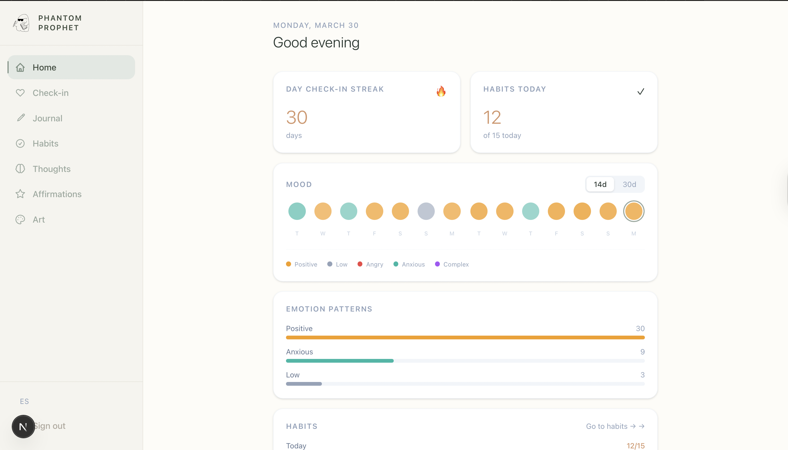
&nbsp;

---

### Daily Check-in
<!-- screenshot: /checkin -->
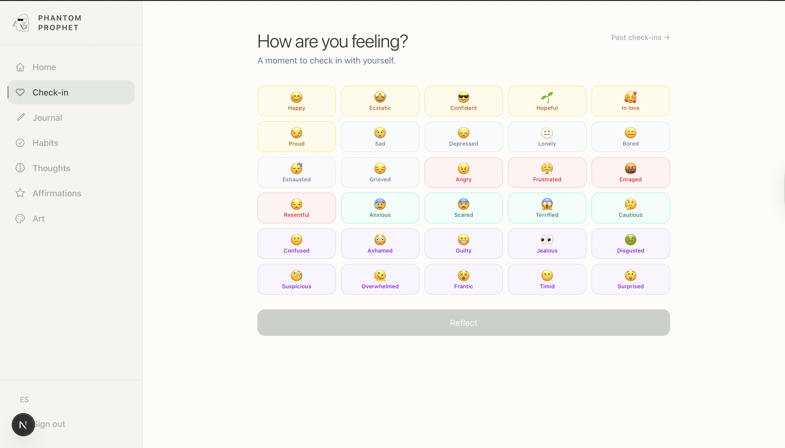

&nbsp;

---

### Journal
<!-- screenshot: /journal and /journal/history -->
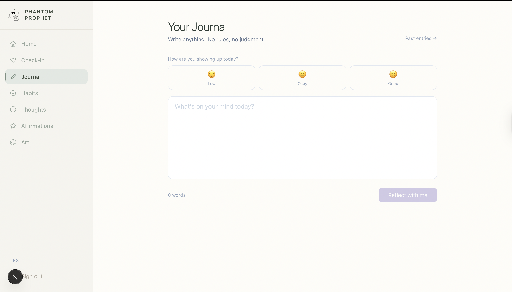
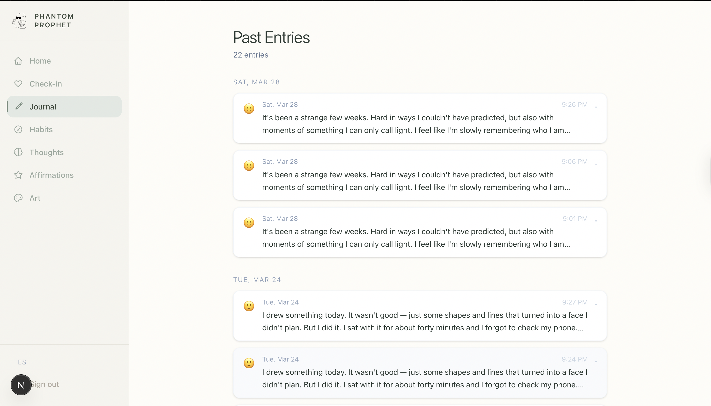

&nbsp;

---

### Thought Records
<!-- screenshot: /thought-records -->
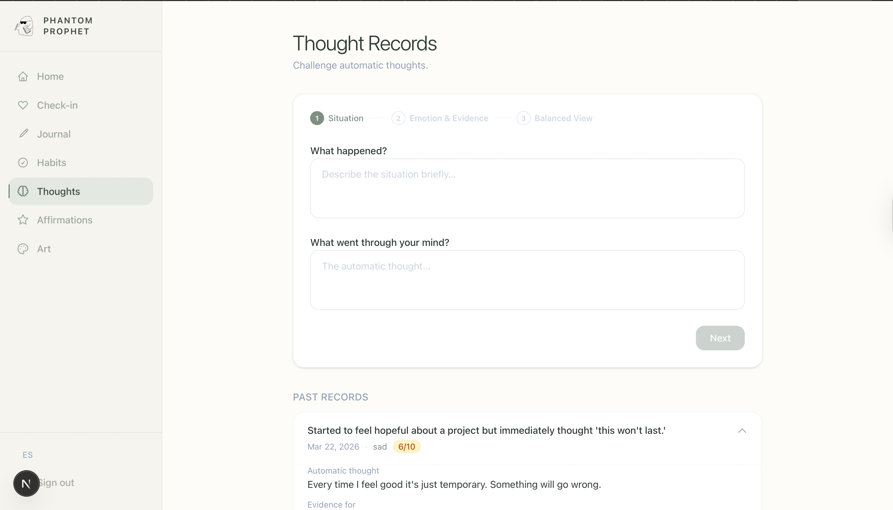
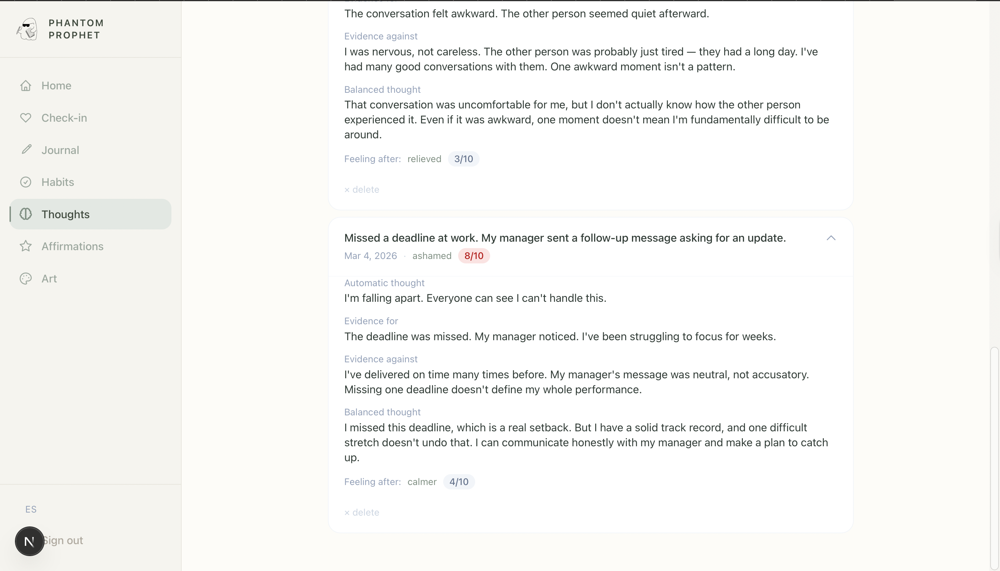

&nbsp;

---

### Habit Tracker
<!-- screenshot: /habits -->
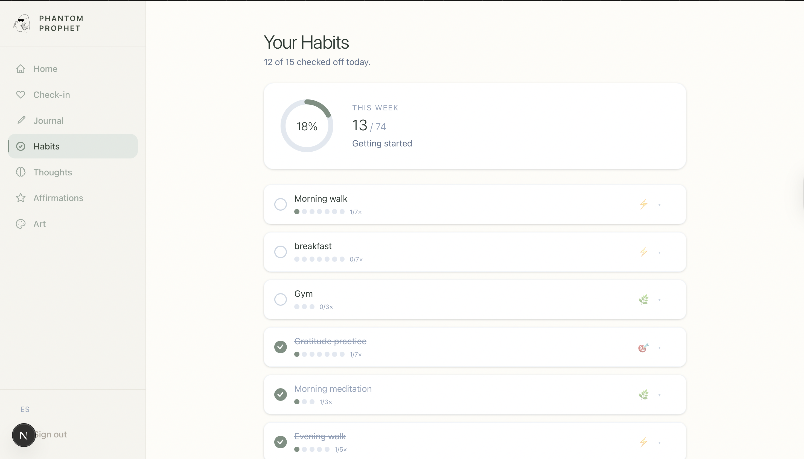

&nbsp;

---

### Art Therapy
<!-- screenshot: /art and /art/[id] -->
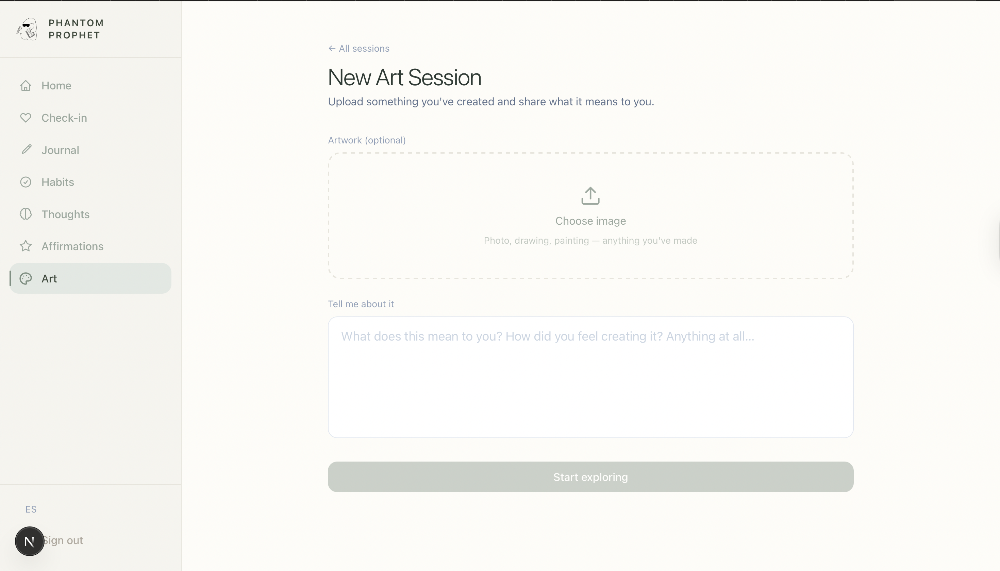
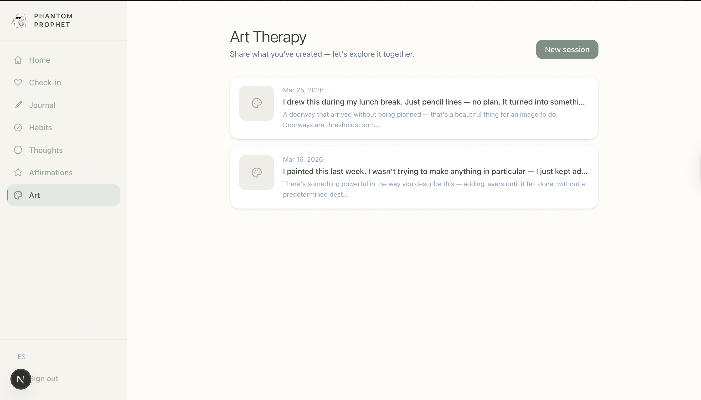
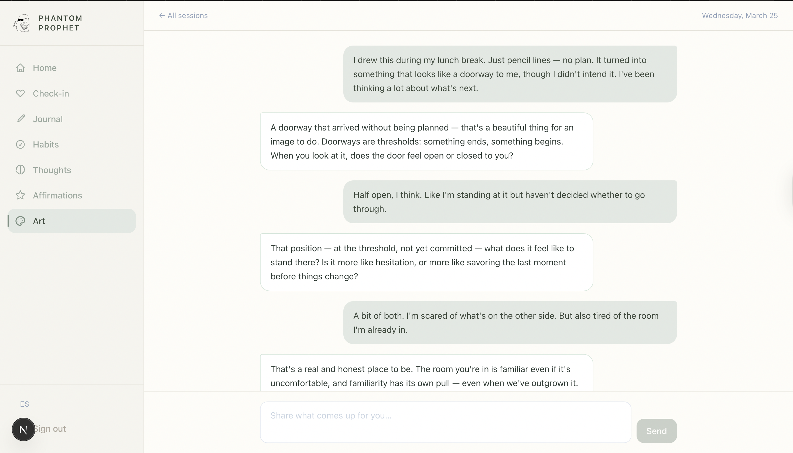

&nbsp;

---

### Therapist Portal
<!-- screenshot: /portal/[patientId] -->
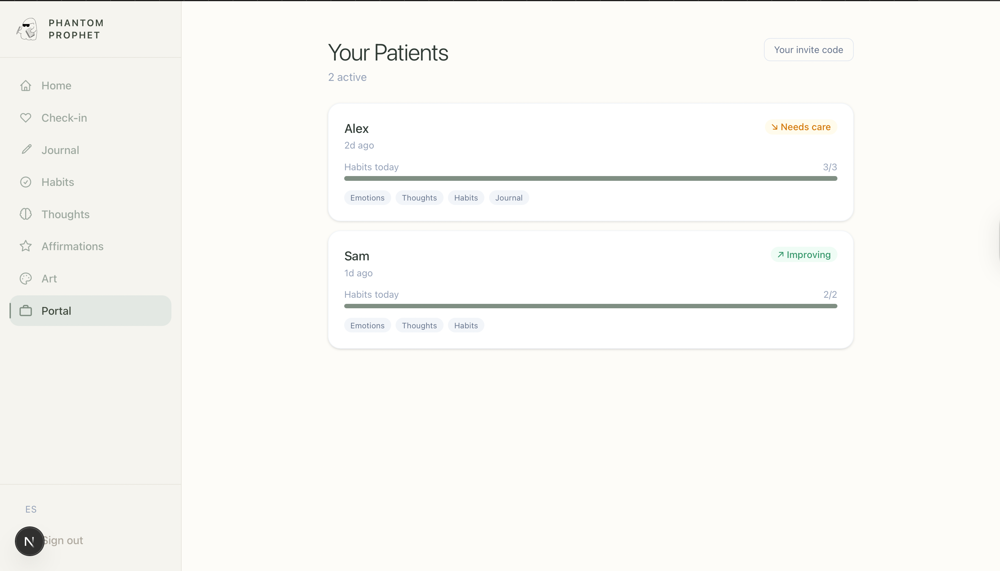

&nbsp;

---

## Features

| Feature | Description |
|---|---|
| **Daily Check-in** | Log mood + intensity each day. The AI responds with a Socratic reflection question. Mood trends are tracked over 30 days. |
| **Journaling** | Free-form private journal. After each entry, the AI offers a thoughtful reflection. Full history with search. |
| **Thought Records** | Guided CBT exercise — situation → automatic thought → evidence → balanced thought → outcome. |
| **Habit Tracking** | Personal wellness habits with weekly targets, commitment levels (gentle / steady / focused), and streak tracking. |
| **Art Therapy** | Upload artwork or drawings, write what you were feeling, and have an open-ended AI conversation about the piece. |
| **Therapist Portal** | With explicit patient consent, therapists view mood trends, journal summaries, thought records, habit progress, and art sessions. |

---

## Tech Stack

- **Framework** — [Next.js 16](https://nextjs.org) App Router (React 19, TypeScript)
- **Database & Auth** — [Supabase](https://supabase.com) (Postgres + Row Level Security + Storage)
- **AI** — [Anthropic Claude](https://anthropic.com) (`claude-sonnet-4-6`) with streaming responses and vision support
- **i18n** — [next-intl](https://next-intl-docs.vercel.app) — English and Spanish
- **Styling** — Tailwind CSS v4

---

## Security

All sensitive content (journal text, AI responses, thought records, art notes) is **encrypted at the application layer using AES-256-GCM** before being written to the database. A database breach exposes only ciphertext.

See [SECURITY.md](SECURITY.md) for the full threat model, encrypted field inventory, key management guide, and HIPAA/GDPR compliance status.

---

## Getting Started

### Prerequisites

- Node.js 18+
- A [Supabase](https://supabase.com) project
- An [Anthropic API key](https://console.anthropic.com)

### Environment Variables

Create `.env.local` in the project root:

```env
NEXT_PUBLIC_SUPABASE_URL=your_supabase_url
NEXT_PUBLIC_SUPABASE_ANON_KEY=your_supabase_anon_key
SUPABASE_SERVICE_ROLE_KEY=your_service_role_key
ANTHROPIC_API_KEY=your_anthropic_api_key
DATA_ENCRYPTION_KEY=your_64_char_hex_key
```

Generate an encryption key:
```bash
openssl rand -hex 32
```

### Install & Run

```bash
npm install
npm run dev
```

Open [http://localhost:3000](http://localhost:3000).

### Other Commands

```bash
npm run build    # Production build
npm run lint     # ESLint
npm start        # Start production server
```

---

## Database Setup

Run the SQL migrations in your Supabase dashboard (SQL Editor) to create all required tables, RLS policies, and the `art` storage bucket. See the schema overview below.

### Schema Overview

| Table | Purpose |
|---|---|
| `daily_checkins` | Mood + intensity + AI reflection per day |
| `journal_entries` | Journal content + AI reflection, field-encrypted |
| `thought_records` | CBT thought record fields, field-encrypted |
| `habits` | Habit definitions with weekly targets |
| `habit_logs` | Daily habit completion logs |
| `art_sessions` | Art therapy sessions with image URL + initial note |
| `art_messages` | Conversation messages within an art session |
| `therapist_profiles` | Therapist display names |
| `patient_therapist_links` | Links patients to therapists with per-category consent flags |

---

## Demo / Seed Data

When running locally, you can populate your account with realistic 30-day demo data:

1. Visit `/en/dev/seed` — seeds check-ins, habits, journal entries, and thought records for your own account
2. Visit `/en/dev/seed-portal` — creates two demo patients (Alex and Sam) with different emotional arcs and links them to your account as a therapist

To clear all seeded data, use the "Clear" button on the same pages.

---

## Deployment

The app is deployed on a DigitalOcean droplet (Ubuntu / Nginx / PM2).

```bash
# On the server
git pull
npm install
npm run build
pm2 restart "wellness app"
```

SSL is managed via Certbot. The `.env.local` file lives only on the server and is never committed to git.

---

## Branch Naming

All branches must follow `<git-user>/<type>/<description>`.

| Type | Use for |
|---|---|
| `feat` | New features |
| `update` | Changes to existing functionality |
| `fix` | Bug fixes |
| `issue` | Addressing a tracked issue |

Examples: `iakor/feat/add-login-page`, `iakor/fix/broken-auth`

The pre-push hook enforces this convention automatically after `npm install`.
